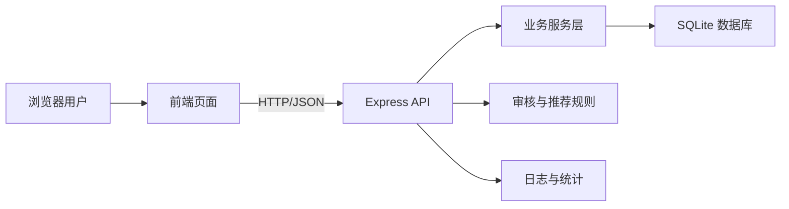

# 架构和类设计文档 architect.md

## 1. 技术选型
系统采用前后端分离架构。前端使用 HTML/CSS/JavaScript 和 Vite，优点是启动快、学习成本低、适合课程设计展示。后端使用 Node.js + Express，便于快速构建 RESTful API。数据库使用 SQLite，适合本地部署和演示，也可平滑迁移到 MySQL 或 PostgreSQL。

## 2. 总体架构

## 3. 分层说明
- 表现层：负责页面展示、表单输入、列表渲染和接口请求。
- 控制层：接收 HTTP 请求，进行参数校验、鉴权和响应封装。
- 业务层：处理注册登录、发帖评论、点赞收藏、关注群组、审核推荐等业务规则。
- 数据访问层：封装数据库增删改查。
- 基础设施层：提供 JWT、密码加密、敏感词过滤、统一错误处理。

## 4. 核心类设计
### User
属性：id、email、phone、passwordHash、nickname、avatar、bio、riskLevel、verifyStatus、role、createdAt。
操作：register()、login()、updateProfile()、submitVerification()、changePrivacy()。

### Board
属性：id、name、description、category、sortOrder、status。
操作：createBoard()、updateBoard()、disableBoard()、listBoards()。

### Post
属性：id、authorId、boardId、title、content、postType、stockTags、status、viewCount、createdAt。
操作：createPost()、updatePost()、deletePost()、markElite()、searchPosts()。

### Comment
属性：id、postId、userId、parentId、content、status、createdAt。
操作：addComment()、replyComment()、deleteComment()、listByPost()。

### Reaction
属性：id、userId、targetType、targetId、reactionType、createdAt。
操作：like()、cancelLike()、favorite()、cancelFavorite()。

### Follow
属性：id、followerId、followingId、starred、createdAt。
操作：follow()、unfollow()、starUser()、listFeed()。

### Group
属性：id、ownerId、name、description、joinType、status、createdAt。
操作：createGroup()、applyJoin()、approveMember()、removeMember()。

### AuditRecord
属性：id、targetType、targetId、riskLevel、reason、status、operatorId、createdAt。
操作：autoCheck()、manualApprove()、reject()、punishUser()。

## 5. 权限设计
- 游客：浏览公开板块、帖子详情和搜索结果。
- 普通用户：发帖、评论、点赞、收藏、关注、申请群组。
- 认证用户：发布专业长文、申请专业认证标识。
- 管理员：板块管理、内容审核、用户管理、数据统计。

## 6. 关键业务规则
1. 未登录用户不能进行写操作。
2. 被禁言用户不能发帖或评论。
3. 命中敏感词或疑似荐股违规的内容进入待审核状态。
4. 点赞、收藏、关注均需防止重复记录。
5. 热榜分数由浏览、评论、点赞、收藏和发布时间衰减共同计算。
6. 用户隐私设置会影响个人资料的可见范围。

## 7. 可扩展性设计
系统保留第三方登录、实名认证、人脸识别、附件审核、全文搜索引擎和推荐算法扩展接口。课程设计阶段以本地可运行版本为主，复杂外部服务通过接口和模拟数据体现。
