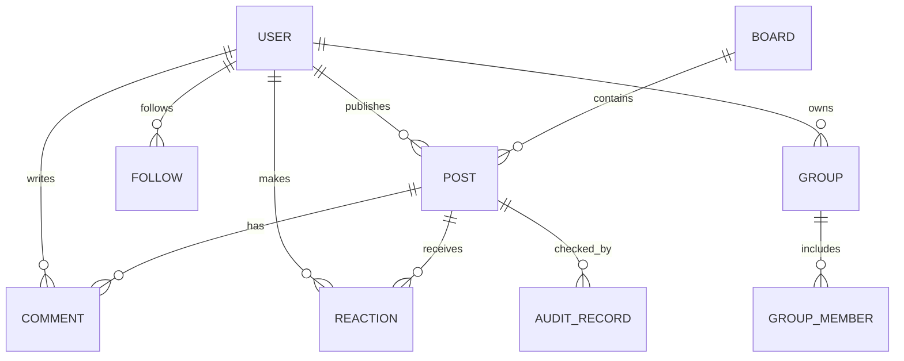

# 数据库设计文档 db.md

## 1. ER 图

## 2. 表设计
### users 用户表
| 字段 | 类型 | 说明 |
|---|---|---|
| id | INTEGER PK | 用户 ID |
| email | TEXT UNIQUE | 邮箱 |
| phone | TEXT | 手机号 |
| password_hash | TEXT | 密码哈希 |
| nickname | TEXT | 昵称 |
| avatar | TEXT | 头像 |
| bio | TEXT | 简介 |
| risk_level | TEXT | 风险等级 |
| verify_status | TEXT | 认证状态 |
| role | TEXT | user/admin |
| muted_until | TEXT | 禁言截止时间 |
| created_at | TEXT | 创建时间 |

### boards 板块表
| 字段 | 类型 | 说明 |
|---|---|---|
| id | INTEGER PK | 板块 ID |
| name | TEXT | 板块名 |
| category | TEXT | 分类 |
| description | TEXT | 描述 |
| sort_order | INTEGER | 排序 |
| status | TEXT | 状态 |

### posts 帖子表
| 字段 | 类型 | 说明 |
|---|---|---|
| id | INTEGER PK | 帖子 ID |
| author_id | INTEGER FK | 作者 |
| board_id | INTEGER FK | 所属板块 |
| title | TEXT | 标题 |
| content | TEXT | 正文 |
| post_type | TEXT | normal/article/poll/flash |
| stock_tags | TEXT | 股票或基金标签 |
| status | TEXT | published/pending/deleted |
| is_elite | INTEGER | 是否精华 |
| view_count | INTEGER | 浏览数 |
| created_at | TEXT | 创建时间 |

### comments 评论表
| 字段 | 类型 | 说明 |
|---|---|---|
| id | INTEGER PK | 评论 ID |
| post_id | INTEGER FK | 帖子 |
| user_id | INTEGER FK | 评论者 |
| parent_id | INTEGER | 父评论 |
| content | TEXT | 内容 |
| status | TEXT | 状态 |
| created_at | TEXT | 创建时间 |

### reactions 互动表
| 字段 | 类型 | 说明 |
|---|---|---|
| id | INTEGER PK | 互动 ID |
| user_id | INTEGER FK | 用户 |
| target_type | TEXT | post/comment |
| target_id | INTEGER | 目标 ID |
| reaction_type | TEXT | like/favorite |
| created_at | TEXT | 创建时间 |

### follows 关注表
| 字段 | 类型 | 说明 |
|---|---|---|
| id | INTEGER PK | 关注 ID |
| follower_id | INTEGER | 关注者 |
| following_id | INTEGER | 被关注者 |
| starred | INTEGER | 是否特别关注 |
| created_at | TEXT | 创建时间 |

### groups 与 group_members 群组表
用于存储用户创建的投资主题群组和成员关系。

### audit_records 审核记录表
用于记录自动审核和人工审核结果，包括风险等级、命中原因、处理状态和处理人。

## 3. 索引设计
1. users.email 建立唯一索引，用于登录和注册校验。
2. posts.board_id、posts.created_at 建立组合查询索引，提高板块帖子列表速度。
3. posts.title、posts.content 建立搜索索引或后续迁移到 Elasticsearch。
4. reactions 使用 user_id + target_type + target_id + reaction_type 唯一约束，避免重复点赞收藏。
5. follows 使用 follower_id + following_id 唯一约束，避免重复关注。

## 4. 数据库创建脚本
完整 SQL 脚本见 `backend/sql/schema.sql`。
